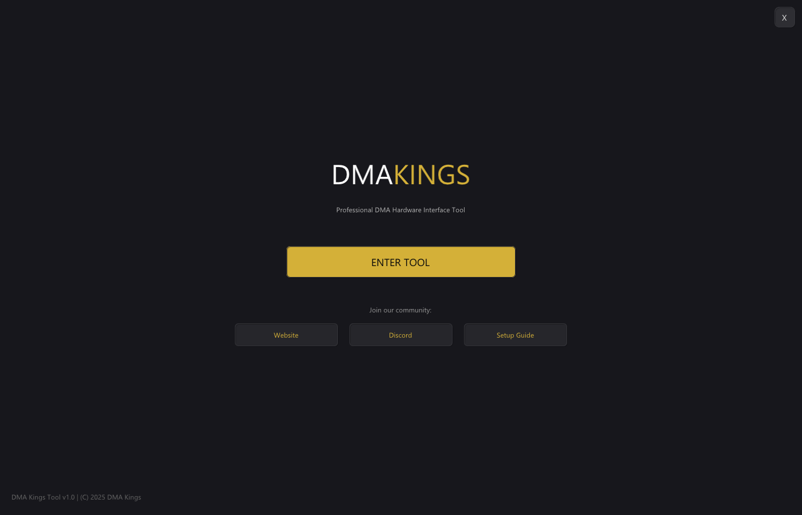
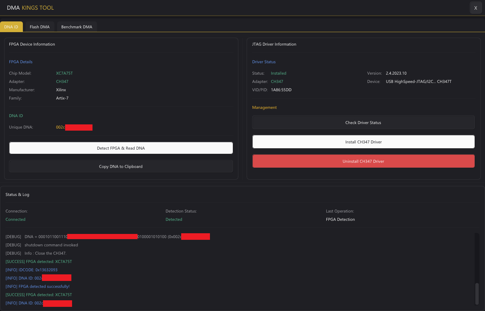
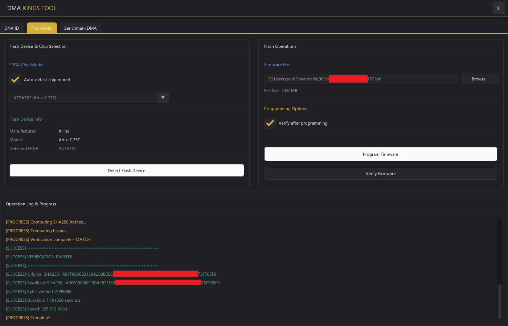
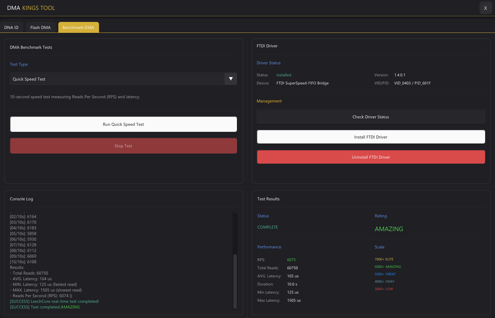

# DMATool - Professional DMA Card Management Suite

**Modern Windows Application for DMA Hardware Interface**

[Download Latest Release](https://github.com/suni2k/DMATool/releases/latest) � [Report Bug](https://github.com/suni2k/DMATool/issues) � [Request Feature](https://github.com/suni2k/DMATool/issues)

---

## ?? Features

### ?? JTAG Port Management
- **FPGA Detection** - Automatic detection of Xilinx Artix-7 FPGAs (XC7A35T, XC7A75T, XC7A100T)
- **DNA ID Reading** - Extract unique 57-bit device DNA identifiers
- **Multi-Adapter Support** - CH347 and RS232/FTDI JTAG adapters
- **Driver Management** - One-click CH347 driver installation/uninstallation

*JTAG interface with FPGA detection and DNA ID extraction*

### ? Flash DMA Programming
- **Firmware Programming** - Flash custom bitstreams to DMA cards
- **Verification** - SHA-256 hash verification of programmed firmware
- **Progress Tracking** - Real-time programming progress and status
- **Safety Features** - Automatic verification before and after programming

*Firmware programming with real-time progress and verification*

### ?? DMA Performance Benchmarking
- **Quick Test** - Fast 4KB DMA read test
- **Throughput Test** - Full performance analysis (4KB to 1GB transfers)
- **Performance Rating** - Automatic A/B/C/D/F grading
- **Real-time Monitoring** - Live speed and status updates

*Complete DMA performance testing with detailed metrics*

---

## ?? Installation

### System Requirements
- **OS**: Windows 10/11 (64-bit)
- **RAM**: 4GB minimum
- **Privileges**: Administrator rights required
- **Hardware**: 
  - DMA card (PCILeech-compatible)
  - JTAG adapter (CH347 or FTDI) for FPGA operations

### Quick Install

1. **Download** the latest release:
   - Go to [Releases](https://github.com/suni2k/DMATool/releases/latest)
   - Download `DMATool.exe`

2. **Run** as Administrator:
   - Right-click `DMATool.exe`
   - Select **"Run as administrator"**

3. **Done!** - No installation required, fully portable

---

## ?? Quick Start Guide

### First Launch

1. **Launch DMATool** as Administrator
2. **Navigate** to the desired tab:
   - **JTAG Port** - for FPGA detection and DNA reading
   - **Flash DMA** - for firmware programming
   - **Data Port** - for benchmarking

### JTAG Operations

**Detect FPGA and Read DNA:**

1. Connect your JTAG adapter to the DMA card
2. Click **"Detect FPGA"**
3. Wait for detection to complete
4. View FPGA model and DNA ID

**Install CH347 Driver:**

1. Click **"Install Driver"**
2. Approve UAC prompt
3. Wait for installation to complete
4. Device will be ready for use

### Flash Programming

**Program Firmware:**

1. Click **"Browse"** to select a `.bin` firmware file
2. Click **"Program Firmware"**
3. Wait for programming and verification
4. Check status for success

?? **Warning**: Do not disconnect power during programming!

### DMA Benchmarking

**Quick Test:**

1. Ensure DMA device is connected
2. Click **"Run Quick Test"**
3. View 4KB read performance

**Full Throughput Test:**

1. Click **"Run Throughput Test"**
2. Wait for all transfer sizes to complete (4KB ? 1GB)
3. View performance rating and detailed results

---

## ?? Supported Hardware

### DMA Cards
- PCILeech-compatible DMA cards
- Squirrel DMA
- Other FPGA-based DMA cards (Artix-7 series)

### FPGA Models
- ? Xilinx XC7A35T
- ? Xilinx XC7A75T (including remarked 50T)
- ? Xilinx XC7A100T

### JTAG Adapters
- ? CH347 USB JTAG/SPI adapter (recommended)
- ? FTDI-based RS232 JTAG adapters

---

## ?? Advanced Features

### Command-Line Support
DMATool runs with a console window for advanced users and logging.

### Driver Management
- Automatic driver detection
- One-click installation/uninstallation
- Version verification

### Resource Extraction
All required tools and drivers are embedded in the exe:
- OpenOCD binaries
- CH347 drivers
- FPGA configuration files

No external dependencies required!

---

## ??? Security & Protection

DMATool uses **VMProtect Ultimate** to protect proprietary algorithms from reverse engineering:

- ? Protected against IDA Pro disassembly
- ? Protected against Hex-Rays decompilation
- ? Anti-debugging measures
- ? Anti-VM detection
- ? Code virtualization

**All core algorithms are secured while maintaining full performance.**

---

## ?? License

**Proprietary Software** - All Rights Reserved

- ? Free to download and use
- ? Reverse engineering prohibited
- ? Redistribution prohibited
- ? Modification prohibited

For commercial licensing inquiries, please open an issue or contact admin@dmakings.com

---

## ?? Troubleshooting

### DMA Device Not Detected

1. Ensure device is properly connected
2. Install LeechCore drivers
3. Run as Administrator
4. Check Device Manager for conflicts

### JTAG Detection Failed

1. Verify JTAG cable connections (TDI, TDO, TCK, TMS, GND)
2. Install CH347 driver via DMATool
3. Check adapter is connected via USB
4. Try different USB port

### Flash Programming Failed

1. Verify firmware file is valid `.bin` format
2. Ensure DMA card is powered on
3. Check JTAG connections
4. Do not disconnect during programming

---

## ?? Contributing

While the source code is not open-source, we welcome:

- ?? Bug reports
- ?? Feature requests
- ?? Documentation improvements
- ?? UI/UX suggestions

Please open an issue with your feedback!

---

## ?? Support

- **Issues**: [GitHub Issues](https://github.com/suni2k/DMATool/issues)
- **Discussions**: [GitHub Discussions](https://github.com/suni2k/DMATool/discussions)

---

## ?? Acknowledgments

Built with:
- [ImGui](https://github.com/ocornut/imgui) - UI framework
- [PCILeech](https://github.com/ufrisk/pcileech) - DMA framework
- [OpenOCD](https://openocd.org/) - JTAG/SPI interface
- [VMProtect](https://vmpsoft.com/) - Code protection

---

**Made with ?? for the DMA community**

[? Back to Top](#dmatool---professional-dma-card-management-suite)

