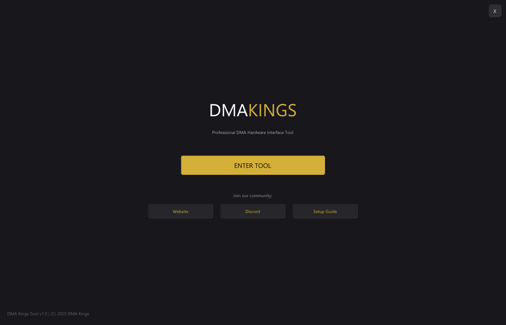
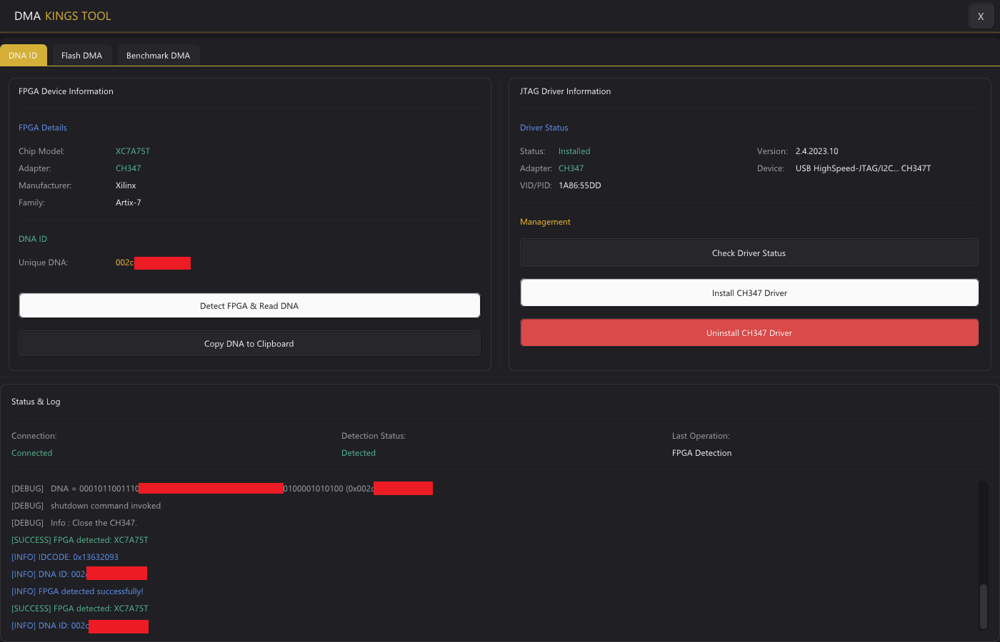
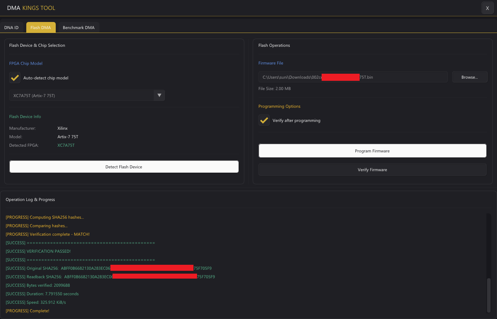
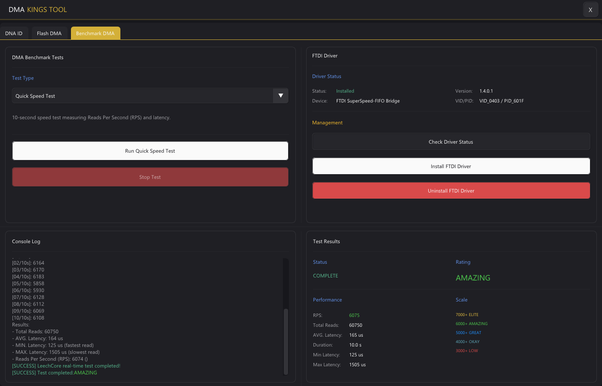

# DMATool - DMA Card Management Suite

[Download Latest Release](https://github.com/suni2k/DMATool/releases/latest)

---

## Features

### JTAG Port
- Automatic detection of Xilinx Artix-7 FPGAs (XC7A35T, XC7A50T, XC7A75T, XC7A100T)
- DNA ID reading
- CH347 and RS232/FTDI JTAG adapter support
- One-click driver installation

### Flash DMA
- Firmware programming with real-time progress
- SHA-256 verification
- Safety checks before and after programming

### DMA Benchmarking
- Quick Speed Test, Throughput Test, Stress Test, Custom Test
- Performance rating (ELITE / AMAZING / GREAT / OKAY / LOW)
- FTDI driver management (check, install, uninstall)

---

## Requirements

- Windows 10/11 (64-bit)
- Administrator privileges
- DMA card with JTAG adapter (CH347 or FTDI)

## Installation

1. Download `DMATool.exe` from [Releases](https://github.com/suni2k/DMATool/releases/latest)
2. Right-click and select **Run as administrator**
3. No installation needed - fully portable

---

## Supported Hardware

| Category | Models |
|----------|--------|
| FPGA | XC7A35T, XC7A50T, XC7A75T, XC7A100T |
| JTAG Adapters | CH347 USB, FTDI RS232 |
| DMA Cards | 35T RS232, 35T/75T/100T CH347 |

---

## Troubleshooting

**DMA device not detected** - Run as Administrator, check USB connections, verify drivers are installed via the Data Port tab.

**JTAG detection failed** - Verify JTAG cable connections (TDI, TDO, TCK, TMS, GND), install CH347 driver via DMATool, try a different USB port.

**Flash programming failed** - Ensure the card is powered, check JTAG connections, do not disconnect during programming.

**FTDI driver issues** - Use the Data Port tab to check driver status. If the version is wrong, uninstall first, then reinstall using the tool.

---

## Support

For bug reports and feature requests: [GitHub Issues](https://github.com/suni2k/DMATool/issues)

---

## License

Proprietary Software - All Rights Reserved

Free to download and use. Redistribution and modification prohibited.

For licensing inquiries: admin@dmakings.com

---

**DMA Kings**

